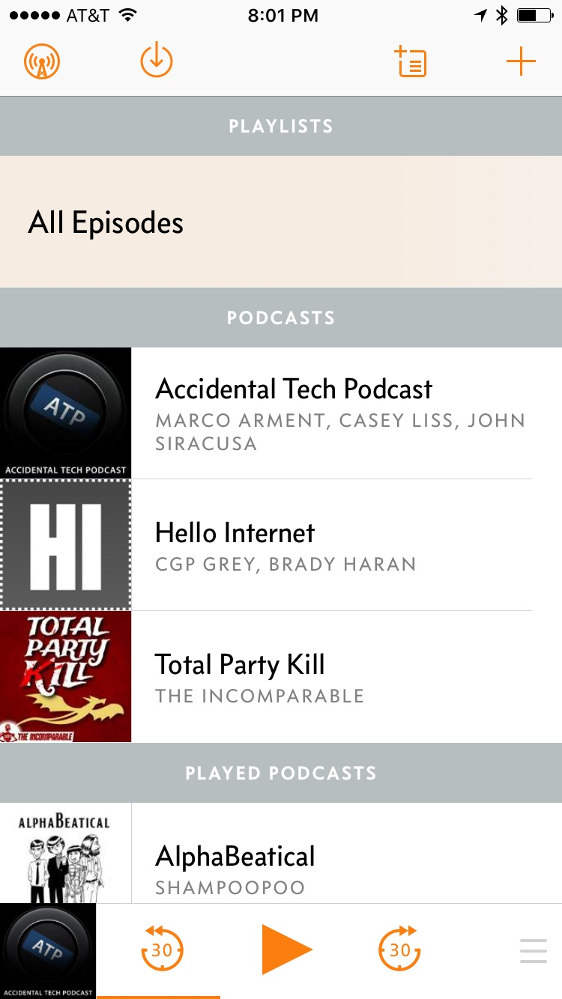
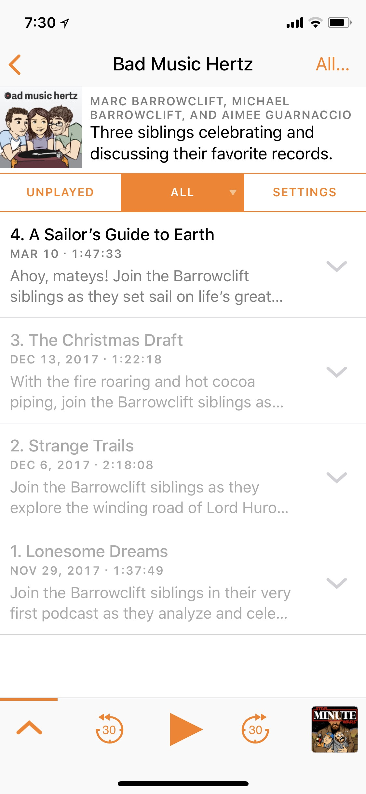
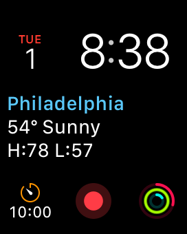
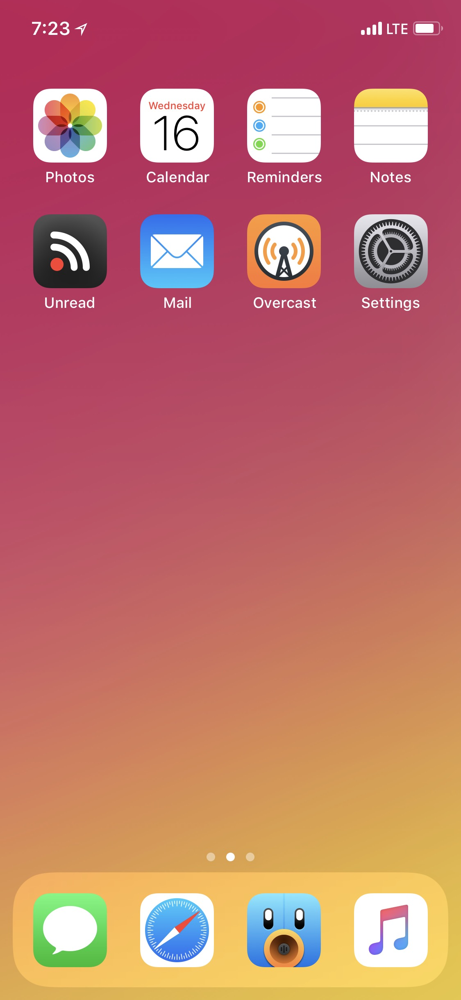

<time>A Markdown theme for humans</time>Marcdown
================================================

I write everything in [Markdown](https://daringfireball.net/projects/markdown), but I've never been particularly satisfied with the available themes. Sure, [Github Flavored Markdown](https://github.com/adam-p/markdown-here/wiki/Markdown-Cheatsheet) is a fine default, but its overemphasis on dividing lines adds too much visual noise for my tastes. I have similar issues with other popular themes; while they each have their own strengths, they all fall short of meeting my three requirements:

1. Tasteful typography
2. Complete support for styling most "unofficial" Markdown features (such as syntax highlighting, tables, etc.)
3. Wide selection of image formatting options
4. Dark / light themes, with the option to switch between them at will in the rendered documents themselves

Given the nature of such specific requirements, I had no choice but to create my own Markdown theme. That theme is Marcdown&mdash;a Markdown theme designed to be just as beautiful for late night journal entries as it is functional for intense computer science notes. Give it a try, I think you're going to love it.

* [Design](#design)
	- [Typeface](#typeface)
	- [Headers](#headers)
	- [Links](#links)
	- [Lists](#lists)
	- [Strikethroughs](#strikethroughs)
	- [Footnotes](#footnotes)
	- [Block Quotes](#block-quotes)
	- [Images](#images)
		* [Edge-to-Edge Options](#edgetoedge-options)
		* [General Options](#general-options)
		* [Captions](#captions)
	- [Code](#code)
	- [Tables](#tables)
	- [Admonitions](#admonitions)
	- [Highlighting](#highlighting)
	- [Definitions](#definitions)
	- [Abbreviations](#abbreviations)
	- [Keyboard Keys](#keyboard-keys)
	- [Advanced Features](#advanced-features)
* [Installation](#installation)
* [About the Author](#about-the-author)

--------------

Design
------

### Typeface

Marcdown was crafted for Apple's [San Francisco](https://developer.apple.com/fonts/) typeface, one of the [finest sans serif typefaces in recent years](https://medium.com/@mach/the-secret-of-san-francisco-fonts-4b5295d9a745#.34yepmqos). However, due to [the restrictive license](https://stackoverflow.com/a/32178596), San Francisco can't be legally bundled with Marcdown.

To account for this (while Marcdown is intended to be used with San Francisco) it leverages [Craig Hockenberry's CSS](https://furbo.org/2018/03/28/system-fonts-in-css/) to use the default system font. This has a number of benefits, both in terms of load speed (no fonts to download, if viewing over the web) and in terms of platform consistency (it'll better "fit in" to your platform of choice).

### Headers

All six headers adhere to a [1.2 minor third scale](http://type-scale.com) with subtle font weighting changes every level to establish and maintain its hierarchy, all [without distracting underlines](http://practicaltypography.com/headings.html). You can see all the headers stacked together [here](/marcdown/headers.html).

### Links

As you've already seen, [this is what links look like](#links), and hovering them adds a subtle blue glow. In Marcdown, color is used to indicate actionable items.

For those times button links are desired, you can use `[Text](url){: .button }` to create buttons like this:

[Go To barrowclift.design](http://barrowclift.design){: .button }

### Lists

* Unordered lists look like this
* The root level uses filled in circles
	- Sub level uses dashes
	- And then...
		* The last available level uses empty circles

1. Ordered lists look like this
2. The root level uses numbers
	1. Sub levels use Latin alphabet characters
	2. And then...
		1. The last available level uses Roman numerals

And of course, checklists are also styled appropriately as well.

* [ ] Thing to do
* [ ] Another thing to do
* [X] Something I've actually done

### Strikethroughs

~~A good chunk of the writing process is drafting~~ Drafting is a crucial phase of the writing process. Sentences can go through countless revisions before they begin to take proper shape, and strikethroughs are perfect for maintaining a nondestructive backlog of your previous approaches for context and future reference.

Due to the nature of strikethroughs being text you want to deemphasis, strikethroughs are one of the few textual elements that have a lighter color than the surrounding text to help guide your eyes over the strikethrough towards its replacement.

### Footnotes

Footnotes look like this[^example-footnote] and are displayed Instapaper-style using [bigfoot.js](http://www.bigfootjs.com). They are also appended inline at the end of the document.

### Block Quotes

Marcdown uses a slightly deemphasized color and line along with italics to distinguish quotes from the rest of the text.

> Here's to the crazy ones. The misfits. The rebels. The troublemakers. The round pegs in the square holes. The ones who see things differently. They're not fond of rules. And they have no respect for the status quo. You can quote them, disagree with them, glorify or vilify them. About the only thing you can't do is ignore them. Because they change things. They push the human race forward. And while some may see them as the crazy ones, we see genius. Because the people who are crazy enough to think they can change the world, are the ones who do.
>
> &ndash; Rob Siltanen

### Images

By default, images are inline and span the full width of the text or stop at their own width, whatever comes first.


This isn't nearly enough for my purposes, which is why Marcdown shamelessly breaks Markdown's rules to allow for an assortment of image options for every occasion using the following structure:

```html
<figure markdown="1" class="$type $option1 $option2 ...">

</figure>
```

The following types are supported:

* __edge-to-edge__: Further detailed in the [Edge-to-Edge Options](#edge-to-edge-options) section.
* __inline__: Caps the image width to the surrounding text's width. If the image's width is smaller than that, the image will *not* be stretched to fill. This is the same style applied to default Markdown images.
* __half-inline__: Caps the image width to exactly half of the surrounding text's width.

While `inline` and `half-inline` are self-explanatory, `edge-to-edge` has a myriad of additional options.

#### Edge-to-Edge Options

Edge-to-edge images types are the most flexible of them all and support an array of size and layout options.

Size options:

* `small`: The image will only "spill" to fill the page's width on mobile devices. It returns to be inline with the text for all larger devices.
* `medium`: Like `small`, but will continue to "spill" a bit beyond the bounding text's width for medium and larger devices to a maximum width of 1000px;
* `large`: Like `medium`, but the amount of "spillage" continues to a maximum width of 1303px.
* `infinite`: The image never stops expanding!

Layout options:

* `two-images`: Display two images side-by-side (most useful for tall images, like iOS screenshots).
* `three-images`: Display three images side-by-side (most useful for tall images, like iOS screenshots).

Here's an example `edge-to-edge` image with no sub-type options provided. This is perfect for very long panoramas.

<figure markdown="1" class="edge-to-edge">

</figure>

Compare that to a taller panorama, this time with the `large` option. This stops the image from expanding beyond 1303px.

<figure markdown="1" class="edge-to-edge large">

</figure>

For long images with a reasonable amount of height to them&mdash;like desktop screenshots&mdash;consider using the `medium` option.

<figure markdown="1" class="edge-to-edge medium">

</figure>

If the image is pretty tall but you still want that "edge-to-edge" experience, you can provide the `small` option to be edge-to-edge on mobile devices only. This is good for ~4:3 aspect ratio images that look uncomfortable going edge-to-edge medium devices or bigger but can can still do so comfortably on small devices.

<figure markdown="1" class="edge-to-edge small">

</figure>

For all the above size sub-types, `two-images` or `three-images` could also be used as additional options to render side-by-side images. In vanilla Markdown, you'd be forced to export a composite image in a separate application to achieve this, but with Marcdown you can just write!

<div markdown="1" class="edge-to-edge large three-images ios-screenshot">



</div>

However, as you'd expect for something more complicated like this, the markup for this element is almost entirely HTML, as Markdown wasn't intended for such things[^intended]. Below is a basic example for `three-images`, and for two images you'd simply use `two-images` instead:

```html
<div markdown="1" class="edge-to-edge large three-images">


</div>
```

Be advised that different Markdown parsers handle the above syntax differently, and you may have to remove all newlines from the block for it to work propely with your parser and parser extensions.

#### General Options

The following image options are supported for __all__ image types:

* `shadow`: Render a nice, general drop-shadow on the image (includes hover animation for linked images)

<figure markdown="1" class="half-inline shadow">
[](img/logo.jpg)
</figure>

* `macos-window-screenshot`: For macOS window screenshots taken [with the shadows disabled](https://www.macgasm.net/2011/05/23/disable-dropshadow-mac-os-window-screenshots/), you can let Marcdown add back in the appropriate border, border radius, and drop shadow to match the macOS look and feel.

<figure markdown="1" class="inline macos-window-screenshot">

</figure>

* `watchos-screenshot`: Intended for watchOS screenshots. watchOS screenshots are different from the others in that the OS takes into consideration the OLED display and surrounding bezel and makes the OS "edge-to-edge" to take advantage of this. Unfortunately, this makes screenshots look quite horrible by default since the contents are taken out of their padded context, making everything look crowded. With this option, the appropriate padding, border, border radius, and drop shadow will be reapplied to best emulate the watch face itself.

<figure markdown="1" class="true-width watchos-screenshot">

</figure>

* `ios-screenshot`: Intended for iOS screenshots; a light border, border radius, and drop shadow will be added.

<figure markdown="1" class="edge-to-edge one-image shadow ios-screenshot">

</figure>

#### Captions

While image comments are not supported in traditional Markdown, they're fully supported in Marcdown for all image types by means of the standard HTML `<figcaption>` element. Below is an example applied to a `small` `edge-to-edge` image:

<figure markdown="1" class="edge-to-edge small">

<figcaption>My siblings and I on the fourth annual "Sibs Trip", photo taken just before beginning the Wild Cave Tour at Mammoth Cave Nation Park</figcaption>
</figure>

The basic markup follows:

```html
<figure markdown="1">

<figcaption>Your photo caption goes here.</figcaption>
</figure>
```

### Code

Markdown's standard inline code snippets with the back-tick (<code>\`</code>) allow you to jot down variable names or short lines of code without breaking your train of thought, they look like this: `exampleMethod()`.

The usual syntax for code blocks remains the same. You can indent blocks of text or surround it with <code>```</code> to render a pre-formatted text block with a dark theme, like so:

	Pre-formatted text
	A format best suited for
	Writing lots of code

If using the <code>```</code> notation, you can [provide a language](https://help.github.com/articles/creating-and-highlighting-code-blocks/#syntax-highlighting) to syntax highlight code with a [Sublime Text](http://www.sublimetext.com) flavored Monokai theme.

```java
public class Example {
	public static void main(String[] args) {
		System.out.println("Hello, world!");
	}
}
```

For *large* code blocks, you may want to surround your code with an `infinite` `edge-to-edge` style, like described in the [Images section](#images)

<div markdown="1" class="edge-to-edge infinite">
```java
// Example below sourced from Robert Sedgewick and Kevin Wayne's Princeton website
// https://introcs.cs.princeton.edu/java/23recursion/Fibonacci.java.html

/******************************************************************************
 *  Compilation:  javac Fibonacci.java
 *  Execution:    java Fibonacci n
 *
 *  Computes and prints the first n Fibonacci numbers.
 *
 *  WARNING:  this program is spectacularly inefficient and is meant
 *            to illustrate a performance bug, e.g., set n = 45.
 *
 *
 *   % java Fibonacci 7
 *   1: 1
 *   2: 1
 *   3: 2
 *   4: 3
 *   5: 5
 *   6: 8
 *   7: 13
 *
 *   Remarks
 *   -------
 *    - The 93rd Fibonacci number would overflow a long, but this
 *      will take so long to compute with this function that we
 *      don't bother to check for overflow.
 *
 ******************************************************************************/
public class Fibonacci {
	public static long fibonacci(int n) {
		if (n <= 1) return n;
		else return fibonacci(n-1) + fibonacci(n-2);
	}

	public static void main(String[] args) {
		int n = Integer.parseInt(args[0]);
		for (int i = 1; i <= n; i++) {
			StdOut.println(i + ": " + fibonacci(i));
		}
	}
}
```
</div>

However, as great as dark themes are, they're not always necessary. Sometimes you just want pre-formatted text that doesn't break the flow of reading too much. In cases like these, you must manually wrap your text with the HTML `<pre>` and `<code>` elements. While not ideal, Markdown by design only allows one particular style to be set to any given element[^one-style-only], so in an effort to address not *always* wanting the Monokai theme to be applied to pre-formatted text blocks, plain old `<pre><code>Your text</code></pre>` is assumed to be regular text and the Monokai theme will not be applied.

<pre><code>I'm performed text,
not code.
 (please
   respect
     my
       spacing!)</code></pre>

And of course, you can still use the `infinite` `edge-to-edge` style for light-themed blocks as well.

<div class="edge-to-edge infinite"><pre><code>I'm performed text,
and I'm filling the screen this time!
It's best
suited
for
when
you
have
lots
of
lines</code></pre></div>

For the ASCII artists out there, you can also easily tighten the font's line height by providing the `ascii-art` class to the `<pre>` element (example below created by [grp](http://www.ascii-code.com/ascii-art/computers/apple.php)).

<pre class="ascii-art">
<code>                   __________________________
		   __..--/".'                        '.
   __..--""      | |                          |
  /              | |                          |
 /               | |    ___________________   |
;                | |   :__________________/:  |
|                | |   |                 '.|  |
|                | |   |                  ||  |
|                | |   |                  ||  |
|                | |   |                  ||  |
|                | |   |                  ||  |
|                | |   |                  ||  |
|                | |   |                  ||  |
|                | |   |                  ||  |
|                | |   |______......-----"\|  |
|                | |   |_______......-----"   |
|                | |                          |
|                | |                          |
|                | |                  ____----|
|                | |_____.....----|#######|---|
|                | |______.....----""""       |
|                | |                          |
|. ..            | |   ,                      |
|... ....        | |  (c ----- """           .'
|..... ......  |\|_|    ____......------"""|"
|. .... .......| |""""""                   |
'... ..... ....| |                         |
  "-._ .....  .| |                         |
	  "-._.....| |             ___...---"""'
		  "-._.| | ___...---"""
			  """""             grp</code>
</pre>

### Tables

Tables are lightly decorated to distinguish the header and rows.

| Band Name      | Favorite Record                       |
|:---------------|:--------------------------------------|
| The Beach Boys | Pet Sounds & SMiLE                    |
| Fleet Foxes    | Helplessness Blues                    |
| Joanna Newsom  | Divers                                |
| The Beatles    | Sgt. Pepper's Lonely Hearts Club Band |

### Admonitions

In rare cases, you may want to preface a document or a section with a prominent announcement communicating some kind of information to the reader. Perhaps this is an "Update" block that provides some new information to the writing below while still preserving the original writing. Or maybe this is a "Warning" block of some kind to forewarn that what follows may trigger those with PTSD or other mental trauma. Whatever the reason, there's an admonition flavor for it.

Here's some examples with the various supported flavors:

!!! Update "Update: March 17, 2017"
	This process has changed as of iOS 10. While the steps below still apply for those on older versions, those running iOS 10+ must follow follow [these steps](#admonitions) instead.

!!! Warning "Trigger Warning"
	What follows are recounts of graphically violent stories that may not be suitable for those dealing with trauma such as PTSD. Reader discretion is advised.

!!! Success "All Tests Passed"
	All tests passed full regression testing.

!!! Unknown "Title"
	Generic admonition block.

### Highlighting

While organizing reference materials or studying, there are times we *really* want to emphasis a word or snippet, so much so that even __bolding__ the text won't suffice. For situations like this, <mark>highlighting is fully supported</mark> using the `==text to highlight==` syntax. For the highlight-lovers out there, multiple flavors like <mark class="red">Red</mark>, <mark class="orange">Orange</mark>, <mark class="yellow">Yellow</mark>, <mark class="blue">Blue</mark>, <mark class="green">Green</mark>, <mark class="purple">Purple</mark>, and <mark class="gray">Gray</mark> are supported.

Additionally, if you want your highlights to function as tags instead, just provide the additional `tag` class:

<mark class="tag red">Red</mark> <mark class="tag orange">Orange</mark> <mark class="tag yellow">Yellow</mark> <mark class="tag blue">Blue</mark> <mark class="tag green">Green</mark> <mark class="tag purple">Purple</mark> <mark class="tag gray">Gray</mark>

### Definitions

If you're writing a technical document or studying, having a nice definitions section is crucial to ensuring you and any other readers can follow along. Definition lists look like this:

Extensible Markup Language (XML)

:   A markup language with a strict set of rules to encode information so that it can be read by both computers and people. It can be used to markup documents as well as represent data structures.

Hypertext Markup Language (HTML)

:   A markup language for creating web pages and web applications semantically. This makes it great for delivering complicated web applications, but makes reading and writing it more difficult. While it may appear to be XML, standard HTML is not XML compliant.

Markdown

:   A lightweight markup language created by [John Gruber](http://daringfireball.net) with the intention of being "as easy-to-read and easy-to-write as is feasible".

### Abbreviations

Marcdown abbreviations are styled in native small caps (assuming support from the user's platform of choice). Readers with pointing devices can hover over them to read the expanded abbreviation with their browser's standard tooltip. Give it a try with "HTML"!

### Keyboard Keys

Representing keyboard keys for things like keyboard shortcuts can be difficult with plain text. Sure, I could write ctrl+alt+del or even `ctrl+alt+del`, but that doesn't look very nice at all. Thankfully, HTML has the `<kbd>` element for exactly this purpose, so you can have <kbd>ctrl</kbd>+<kbd>alt</kbd>+<kbd>del</kbd> instead. Your keyboard shortcuts never looked this good.

### Advanced Features

While not enabled by default, Marcdown is fully capable of rendering complex UML diagrams with [flowchart.js](http://flowchart.js.org) and [sequence-diagram.js](https://bramp.github.io/js-sequence-diagrams/). [Click here to see these features in action](/marcdown/advanced-features.html)

Installation
------------

Due to Marcdown relying on Markdown extensions for things like syntax highlighting and the necessary scripting required for enabling/disabling dark mode, some installation is required for Marcdown to operate at its fullest potential. Thankfully, if you already do your writing in [Sublime Text](http://www.sublimetext.com) like I do, the installation is very straightforward:

1. Clone or download the Marcdown project and place at `/usr/local` on your file system. You can place it wherever you want on your system, but do note then you must update the paths in the `local-template.html` file accordingly.
2. Install the [Markdown Preview](https://github.com/revolunet/sublimetext-markdown-preview) plugin.
3. Open the Markdown Preview user settings and edit to match [this one](https://github.com/barrowclift/marcdown/blob/master/markdown-preview/MarkdownPreview-2.x.sublime-settings), as desired. Do note that removing or adding new plugins may negatively affect Marcdown rendering.
	* Remember, if you want any [advanced features](/marcdown/advanced-features.html) like UML or MathJax, you'll have to ensure the proper `js` files are included (they're commented out in the provided example settings file).

Regrettably, there's no detailed guides currently available for setting up Marcdown with other popular Markdown build systems (yet), so your only option at the moment is to use Sublime Text with Markdown Preview or to work it out yourself with your preferred system. More setup instructions for other environments are planned to be added over time, so stay tuned!

About the Author
----------------


Hey there :wave:, my name is Marc Barrowclift and I'm a designer and developer who loves making nice things. You can follow my writings over at [barrowclift.design](http://barrowclift.design) or check out my other projects on [Github](https://github.com/barrowclift).

[^example-footnote]: This is an example footnote. You can insert asides, references, inside jokes, and all other sorts of things with footnotes.
[^intended]: As if that would stop me. :wink:
[^one-style-only]: Yes, [classes can be added to simple elements](https://michelf.ca/projects/php-markdown/extra/#spe-attr) like links and standard images, but unfortunately this does not extend to more complicated elements like lists or code blocks.

*[ASCII]: American Standard Code for Information Interchange
*[CSS]: Cascading Style Sheets
*[HTML]: Hyper Text Markup Language
*[UML]: Unified Modeling Language
*[XML]: Extensible Markup Language